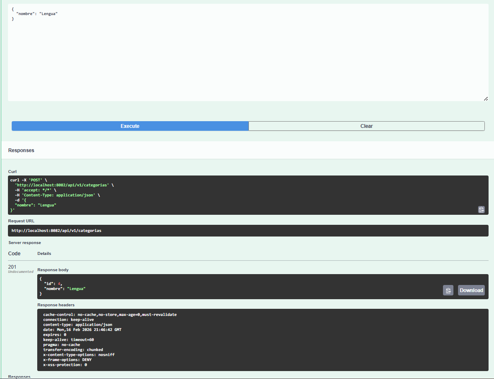
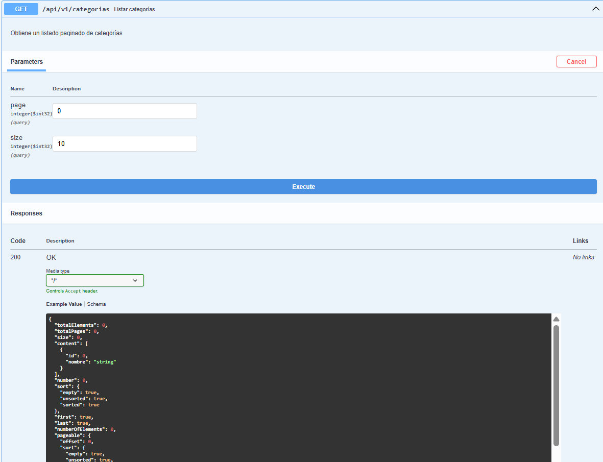
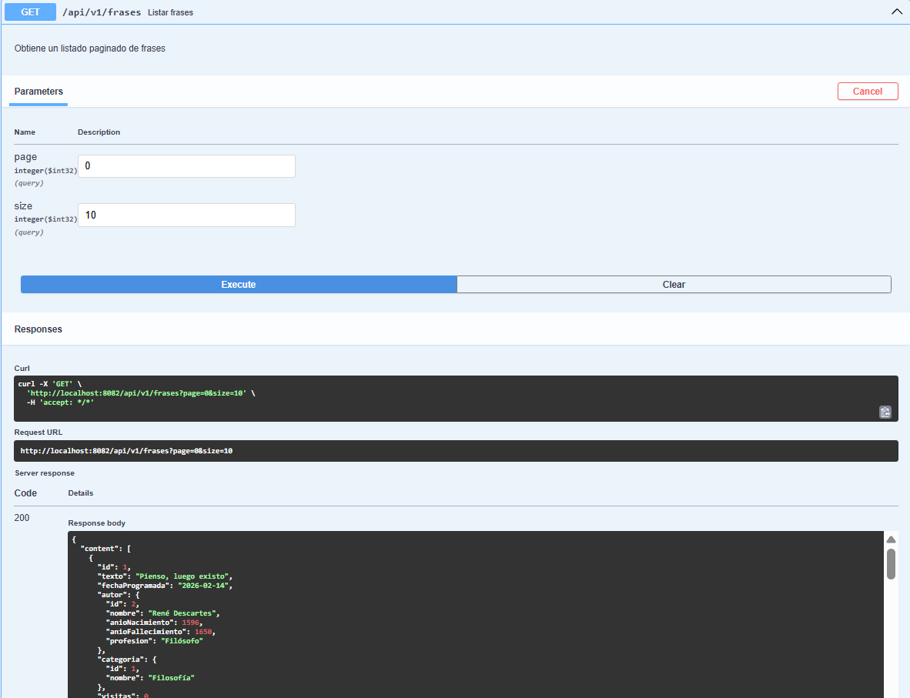

# API Frases Célebres

Proyecto API REST en Spring Boot para gestionar y consultar frases célebres, desarrollado como práctica del Tema 4 de Acceso a Datos.

## Requisitos

- Java 21
- Gradle (incluido wrapper)
- PostgreSQL

## Puesta en marcha

1. Crear una base de datos en PostgreSQL llamada `frases`.
2. Configurar usuario y contraseña en `src/main/resources/application.properties` (actualmente configurado como `root`/`test`). Asegúrate de que coincidan con tu instalación local de PostgreSQL.

## Capturas de Pantalla

1. **Ejemplo 1 (Listar Frases):**
   

2. **Ejemplo 2 (Frase del Día):**
   

3. **Ejemplo 3 (Login / Token):**
   

## Usuarios de Prueba

| Username | Password | Rol      |
| -------- | -------- | -------- |
| admin    | admin    | ADMIN    |
| user     | admin    | STANDARD |

## Documentación API

Swagger UI disponible en: [http://localhost:8082/swagger-ui/index.html](http://localhost:8082/swagger-ui/index.html)

### Ejemplo de Endpoints

- `GET /api/v1/frases/dia`: Frase del día.
- `GET /api/v1/autores`: Listado de autores.
- `POST /api/v1/frases` (Requiere autenticación ADMIN): Crear frase.

## Funcionalidades Extra

1.  **Búsqueda por texto**:
    - `GET /api/v1/frases/search?texto=vida`: Busca frases que contengan la palabra.
2.  **Contador de Visitas**:
    - Cada vez que se consulta `GET /api/v1/frases/{id}`, se incrementa el contador de visitas.
3.  **Sistema de Valoraciones (Likes/Dislikes)**:
    - `POST /api/v1/frases/{id}/valoraciones`: Votar (Body: `{ "positiva": true }`).
    - `GET /api/v1/frases/top?limit=5`: Obtener las frases mejor valoradas.

## Tecnologías

- Spring Boot 3.4.2
- Spring Data JPA
- Spring Security
- PostgreSQL
- OpenAPI (Swagger)
- Lombok
